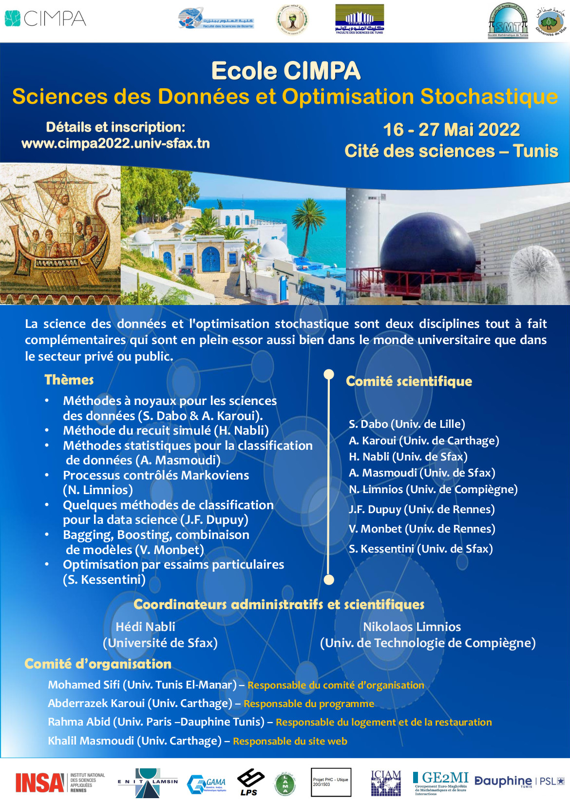

The University of Sfax and the Tunisian Mathematical Society organize next year the CIMPA School on « Data Science and Stochastic optimization ». This scientific event will hold in the City of Sciences in Tunis between 16 and 27 May 2022. For further details, please visit the <a href = " https://www.cimpa.info/en/node/7118">official website</a>.
