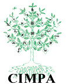
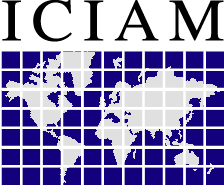

The Committee for Developing Countries is a committee of the <a href="http://euro-math-soc.eu/" title="The European Mathematical Society">European Mathematical Society (EMS)</a>; its terms of reference can be found <a href = "http://www.euro-math-soc.eu/committee/developing-countries">here</a>. Click on the links above to find out about our activities, or browse the following resources which were used at ICM2014 to describe our work: <a href="Beamer2014.pdf">presentation</a> | <a href="Poster2014.pdf">poster</a> | <a href = "Leaflet2014.pdf">leaflet</a>. 

To contact the CDC, please email <a href = "mailto:cdc-chair@ems-cdc.org">cdc-chair@ems-cdc.org</a>, or contact one of our <a href = "members">members</a> directly.

We work alongside a number of organisations, including:

<table style="border-collapse: collapse;" bgcolor="#8080e0" border="0" bordercolor="#111111" cellpadding="0" cellspacing="0" height="500" width="100%">

  <tbody><tr>

    <td height="19" width="20%">&nbsp;</td>

    <td height="19" width="20%">&nbsp;</td>

    <td height="19" width="20%">&nbsp;</td>

    <td height="19" width="20%">&nbsp;</td>

    <td height="19" width="20%">&nbsp;</td></tr>

  <tr>

    <td height="107" width="20%">&nbsp;</td>

    <td height="107" width="20%">

     

       

       

    </td>

    <td height="107" width="20%">&nbsp;</td>

    <td height="107" width="20%">

     

       

       

    </td>

    <td height="107" width="20%">&nbsp;</td>

  </tr>

  <tr>

    <td height="156" width="20%">

    <a href="http://www.mathunion.org/cdc/">   

    <b>IMU-CDC</b></a> 

         

    </td>

    

    <td height="156" width="20%">&nbsp;</td>

    <td height="156" width="20%"> 
</td>

    <td height="156" width="20%">&nbsp;</td>

    <td height="156" width="20%"></td>

  </tr>

  <tr>

    <td height="156" width="20%">&nbsp;</td>

    <td height="156" width="20%">

   </td>
 

     

      </td>

    <td height="107" width="20%">&nbsp;</td>

    <td height="107" width="20%">

   </td>

  </tr>

  <tr>

    <td height="107" width="20%">

       

     </td>

    <td height="107" width="20%">&nbsp;</td>

    <td height="107" width="20%">

    </td>

    

         <td height="107" width="20%">

    </td>

  </tr>

    <tr>

          <td height="107" width="20%">&nbsp;</td>

    <td height="107" width="20%">

     

    </td>

    <td height="107" width="20%"><a href="http://www.zbmath.org/">reviewers</a></td>

    <td height="107" width="20%">&nbsp;</td>

    <td height="107" width="20%">

    <a href="http://bordeauxtheque.math.u-bordeaux1.fr/">Bordeauxtheque</a></td></tr>

