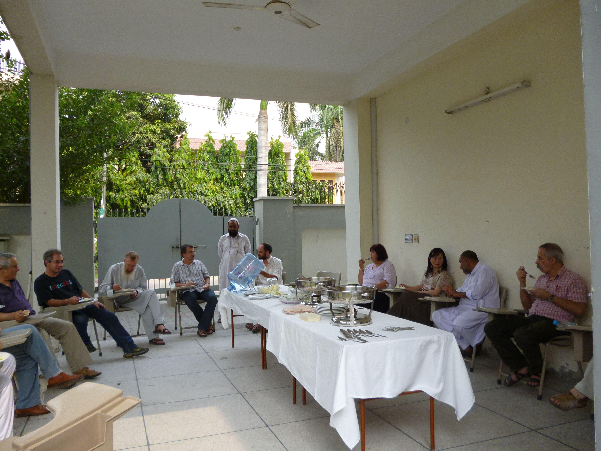
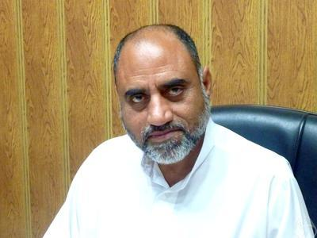

 

Until 2015, the director of ASSMS was Alla Ditta Raza Choudary.   You can read his 2015 report for the ERCE programme <a href = "ASSMS report 2015.pdf">here</a>. The new director is Shahid Saeed Siddiqui.  More information on ASSMS can be found <a href = "http://www.gcu.edu.pk/ASSMS.htm">at their webpage</a>.

