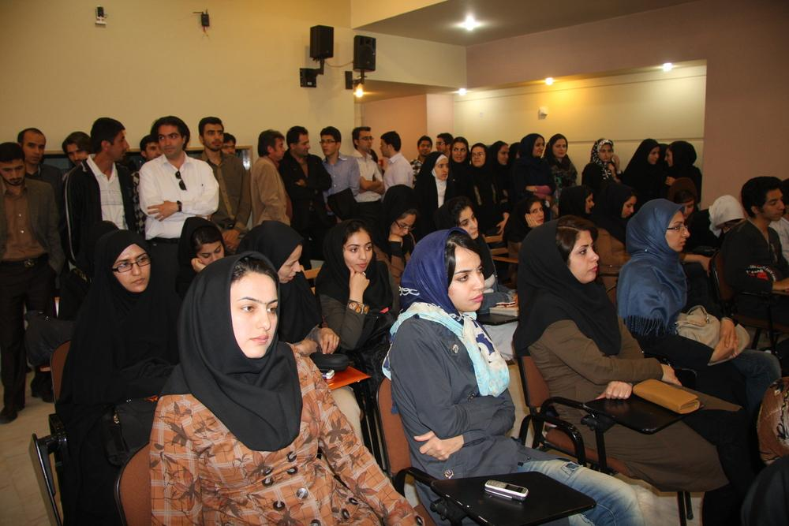
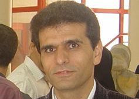

 
Based in Zanjan, Iran, IASBS received the ERCE label in 2014.

The director of IASBS is Dr Hamid Reza Khalesifard. The person in charge of the ERCE label is Rashid Zaare Nahandi.  You can read his 2015 report for the ERCE programme <a href = "IASBS report 2015.pdf">here</a>.   More information on ASSMS can be found <a href = "http://www.gcu.edu.pk/ASSMS.htm">at their webpage</a>.

