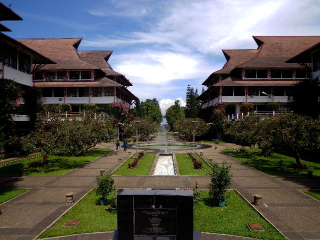

 
Based in Bandung, Indonesia this department received the ERCE label in 2016.

More information on the department of mathematics can be found at the <a href="http://www.math.itb.ac.id/curriculum/">following webpage</a> for master program and <a href="http://www.math.itb.ac.id/doctoral-program/">this webpage</a> for doctoral program.

