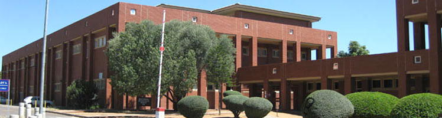

 
Based in Gaborone, Botswana, this department received the ERCE label in 2016.

More information on the department of mathematics can be found <a href = "http://www.ub.bw/home/ac/1/fac/1/faculty-of-science/">at their webpage</a>.

