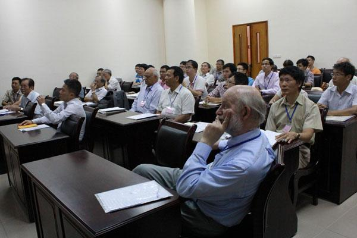

---
title: Vietnam Institute for Advanced Studies in Mathematics (VIASM)
date: 2014-03-11T19:18:39+00:00
author: nickgill
layout: page
---</H2>

 
Based in Hanoi, Vietnam, VIASM received the ERCE label in 2013.

The Managing Director of VIASM is Professor Nguyen Huu Du.   You can read his 2015 report for the ERCE programme <a href = "VIASM report 2015.pdf">here</a>.   More information on VIASM can be found <a href = "http://viasm.edu.vn/?lang=en">at their webpage</a>.

