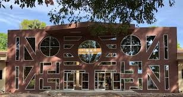

 
Ziguinchor Laboratory of Applied Mathematics is a research department of the University Assane Seck of Zuiguinchor, based in Senegal.

More information on the department of mathematics can be found <a href = "http://www.univ-zig.sn/">at the university webpage</a>. The head of the laboratory is interviewed <a href = "https://www.youtube.com/watch?v=1-O94lIGhY0">here</a>.

