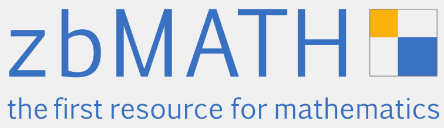

zbMATH is a mathematics-reviewing service (edited by the EMS, FIZ
Karlsruhe, and the Heidelberg Academy) that can be accessed online at <a href = "http://www.zbmath.org">www.zbmath.org</a>. The site indexes all relevant mathematics journals, with complete coverage back to 1868.  Every article published since
1868 is linked, with metadata and additional review resp. abstract
available on the site. Other features include access to author
profiles including citation profiles, links to full texts, a database
of mathematical software (<a href = "http://www.swmath.org">www.swmath.org</a>) and more.

In general, to access the full features of zbMATH institutions have to
<a href="https://zbmath.org/subscription/">pay a subscription</a>. However, zbMATH provides free access to a large number of developing countries. The list of these countries is <a href = "zbmath2">here</a>. Please ask for free access by writing an email to: 

zbMATH is also able to provide free access to participants in conferences and workshops in developing countries. In order to facilitate this, organisers should send a request to the above email some time before the conference takes place.

More info on zbMATH: 
[<a href = "zbposter.pdf">zbMATH poster</a> | <a href="IndividualReports/Greuel2015.php">Latest report to EMS-CDC</a>]

