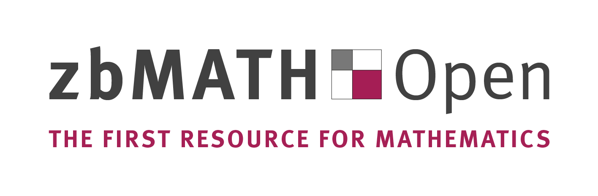

zbMATH is a mathematics-reviewing service (edited by the EMS, FIZ
Karlsruhe, and the Heidelberg Academy) that can be accessed online at <a href = "http://www.zbmath.org">www.zbmath.org</a>. The site indexes all relevant mathematics journals, with complete coverage back to 1868.  Every article published since
1868 is linked, with metadata and additional review resp. abstract
available on the site. Other features include access to author
profiles including citation profiles, links to full texts, a database
of mathematical software (<a href = "http://www.swmath.org">www.swmath.org</a>) and more.

We are happy to report that ZbMath is now <b>free to use</b>. This is a fantastic service to the mathematics community and it is wonderful that students and researchers from all over the world have free access to this resource.
